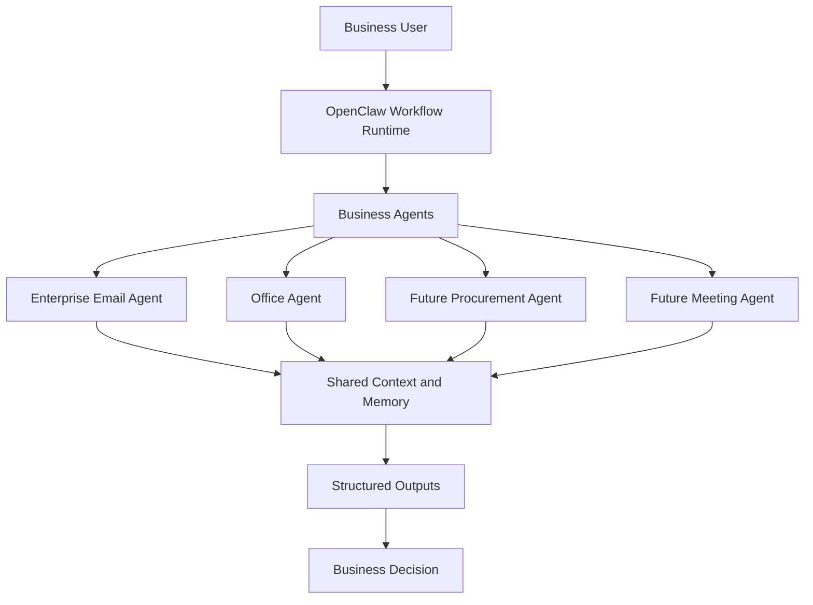

# OpenClaw Overall Architecture

This diagram shows OpenClaw as a local AI workflow operating layer. The Enterprise Email Agent is the main business case.

The `.mmd` file is kept as the editable source version: [01_openclaw_architecture.mmd](01_openclaw_architecture.mmd).

Back to [Diagrams](README.md).

