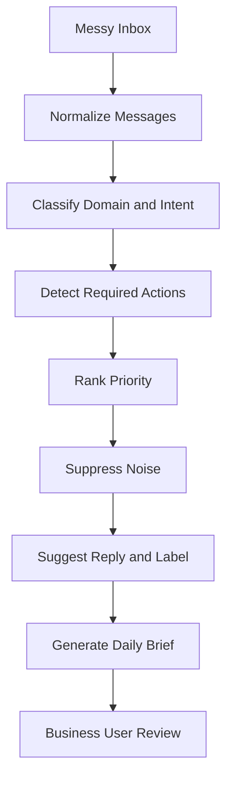

# Enterprise Email Agent Workflow

This diagram shows how the Email Agent turns messy inbox activity into structured daily priorities and suggested actions.

The `.mmd` file is kept as the editable source version: [02_email_agent_workflow.mmd](02_email_agent_workflow.mmd).

Back to [Diagrams](README.md).

