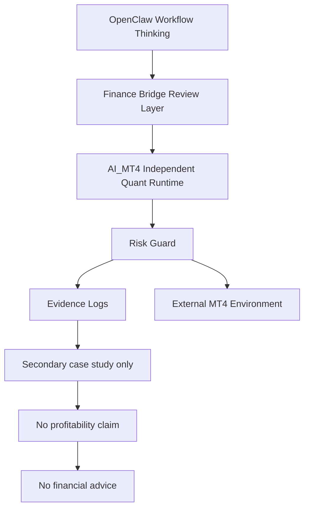

# AI-MT4 Boundary Diagram

This diagram is a secondary case study only. It shows runtime separation, risk boundaries, and evidence logging. It is not financial advice and does not claim profitability.

The `.mmd` file is kept as the editable source version: [03_ai_mt4_boundary.mmd](03_ai_mt4_boundary.mmd).

Back to [Diagrams](README.md).

